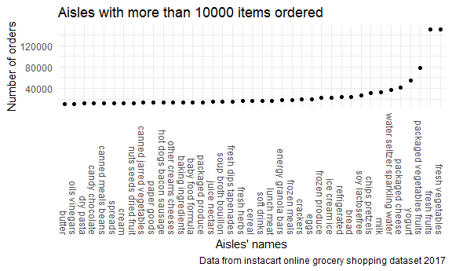

P8105\_hw3\_ys3394
================
Yifan Su
10/10/2020

## Problem 1

#### Do some exploration of the dataset “instacart”.

``` r
data("instacart")
```

**A Short description**

  - This dataset contains 1384617 rows and 15 columns.

  - This instacart online grocery shopping dataset has information about
    orders of users on the instacart, with each row represents the data
    of one product of an order.

  - Key variables of user and order are – user ID, order day and order
    hour. They are other variables about items and products, including
    aisle, department and their ID numbers. It’s worth noticing that
    there are many aisles in a department, and products with different
    aisles and departments ID are distinct.

Number of ailes, and show aisles that most items ordered from.

``` r
instacart %>% 
  count(aisle) %>% 
  arrange(desc(n))
```

    ## # A tibble: 134 x 2
    ##    aisle                              n
    ##    <chr>                          <int>
    ##  1 fresh vegetables              150609
    ##  2 fresh fruits                  150473
    ##  3 packaged vegetables fruits     78493
    ##  4 yogurt                         55240
    ##  5 packaged cheese                41699
    ##  6 water seltzer sparkling water  36617
    ##  7 milk                           32644
    ##  8 chips pretzels                 31269
    ##  9 soy lactosefree                26240
    ## 10 bread                          23635
    ## # ... with 124 more rows

Make a plot shows number of items and those greater than 10000 items
ordered.

``` r
instacart %>% 
  count(aisle) %>%
  filter(n > 10000) %>% 
  mutate(
    aisle = factor(aisle),
    aisle = fct_reorder(aisle, n)
  ) %>%  # convert aisle to a factor variable, then we can use the function fct_reorder to adjust order.
  ggplot(aes(x = aisle, y = n)) +
  geom_point() +
  theme(axis.text.x = element_text(angle = 270, vjust = 0.5, hjust = 1)) +
  labs(
    title = "Aisles with more than 10000 items ordered",
    x = "Aisles' names",
    y = "Number of orders",
    caption = "Data from instacart online grocery shopping dataset 2017"
  )
```



Make a table showing the three most popular items in each of the aisles.

``` r
instacart %>% 
  filter(aisle %in% c("baking ingredients", "dog food care", "packaged vegetables fruits")) %>% 
  group_by(aisle) %>% 
  count(product_name) %>% 
  mutate(
    rank = min_rank(desc(n))
  ) %>% 
  filter(rank < 4) %>% 
  arrange(aisle, rank) %>% 
  knitr::kable(digits = 2)
```

| aisle                      | product\_name                                 |    n | rank |
| :------------------------- | :-------------------------------------------- | ---: | ---: |
| baking ingredients         | Light Brown Sugar                             |  499 |    1 |
| baking ingredients         | Pure Baking Soda                              |  387 |    2 |
| baking ingredients         | Cane Sugar                                    |  336 |    3 |
| dog food care              | Snack Sticks Chicken & Rice Recipe Dog Treats |   30 |    1 |
| dog food care              | Organix Chicken & Brown Rice Recipe           |   28 |    2 |
| dog food care              | Small Dog Biscuits                            |   26 |    3 |
| packaged vegetables fruits | Organic Baby Spinach                          | 9784 |    1 |
| packaged vegetables fruits | Organic Raspberries                           | 5546 |    2 |
| packaged vegetables fruits | Organic Blueberries                           | 4966 |    3 |

Make a table of the mean hour of the day of two items in a week.

``` r
instacart %>% 
  filter(product_name %in% c("Pink Lady Apples", "Coffee Ice Cream")) %>% 
  group_by(product_name, order_dow) %>% 
  summarize(mean_hour = mean(order_hour_of_day)) %>% 
  pivot_wider(
    names_from = order_dow,
    values_from = mean_hour,
    names_prefix = "mean_order_hour_of_day_"
  ) %>% 
  t() %>% 
  knitr::kable(digits = 2)
```

    ## `summarise()` regrouping output by 'product_name' (override with `.groups` argument)

    ## Warning in kable_pipe(x = structure(c("product_name",
    ## "mean_order_hour_of_day_0", : The table should have a header (column names)

|                               |                  |                  |
| :---------------------------- | :--------------- | :--------------- |
| product\_name                 | Coffee Ice Cream | Pink Lady Apples |
| mean\_order\_hour\_of\_day\_0 | 13.77419         | 13.44118         |
| mean\_order\_hour\_of\_day\_1 | 14.31579         | 11.36000         |
| mean\_order\_hour\_of\_day\_2 | 15.38095         | 11.70213         |
| mean\_order\_hour\_of\_day\_3 | 15.31818         | 14.25000         |
| mean\_order\_hour\_of\_day\_4 | 15.21739         | 11.55172         |
| mean\_order\_hour\_of\_day\_5 | 12.26316         | 12.78431         |
| mean\_order\_hour\_of\_day\_6 | 13.83333         | 11.93750         |

# Comment on each results

## Problem 2

``` r
chf_df =
  read_csv("./data/accel_data.csv") %>% 
  janitor::clean_names() %>% 
  pivot_longer(
    activity_1:activity_1440,
    names_to = "minute_day",
    values_to = "activity_counts",
    names_prefix = "activity_"
    ) %>% 
  mutate(
    minute_day = as.integer(minute_day),
    week = as.factor(week),
    day_id = as.factor(day_id),
    day = as.factor(day),
    weekday_weekend = case_when(
      day %in% c("Monday", "Tuesday", "Wednesday", "Thursday", "Friday") ~ "weekday",
      day %in% c("Saturday", "Sunday") ~ "weekend"),
    weekday_weekend = as.factor(weekday_weekend),
    )
```

    ## Parsed with column specification:
    ## cols(
    ##   .default = col_double(),
    ##   day = col_character()
    ## )

    ## See spec(...) for full column specifications.

\#Describe results

**Traditional analyses of accelerometer data focus on the total activity
over the day**

``` r
chf_df %>% 
  group_by(week, day) %>% 
  summarize(sum_counts = sum(activity_counts)) %>% 
  pivot_wider(
    names_from = day,
    values_from = sum_counts
  ) %>% 
  knitr::kable(digits = 2)
```

    ## `summarise()` regrouping output by 'week' (override with `.groups` argument)

| week |   Friday |    Monday | Saturday | Sunday | Thursday |  Tuesday | Wednesday |
| :--- | -------: | --------: | -------: | -----: | -------: | -------: | --------: |
| 1    | 480542.6 |  78828.07 |   376254 | 631105 | 355923.6 | 307094.2 |    340115 |
| 2    | 568839.0 | 295431.00 |   607175 | 422018 | 474048.0 | 423245.0 |    440962 |
| 3    | 467420.0 | 685910.00 |   382928 | 467052 | 371230.0 | 381507.0 |    468869 |
| 4    | 154049.0 | 409450.00 |     1440 | 260617 | 340291.0 | 319568.0 |    434460 |
| 5    | 620860.0 | 389080.00 |     1440 | 138421 | 549658.0 | 367824.0 |    445366 |
