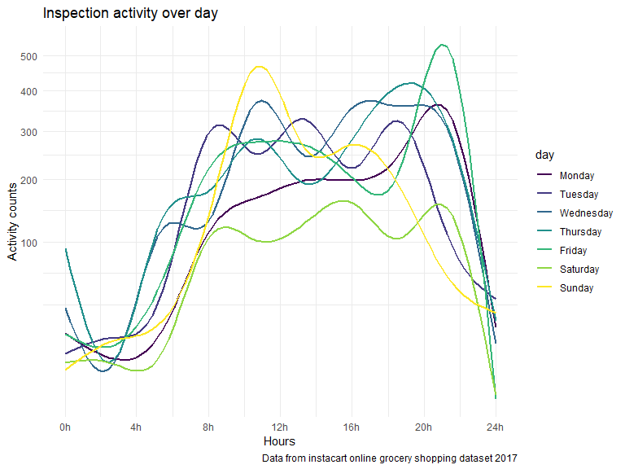
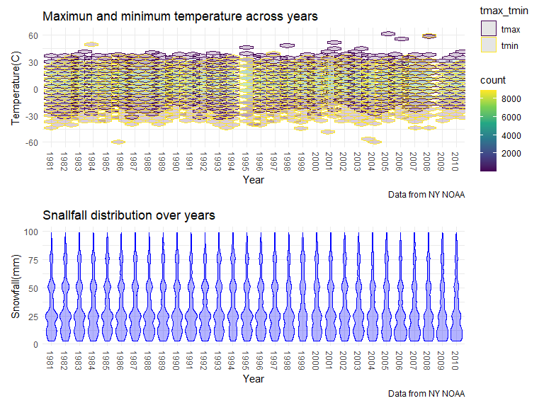

P8105\_hw3\_ys3394
================
Yifan Su
10/10/2020

## Problem 1

#### Do some exploration of the dataset “instacart”.

``` r
data("instacart")
```

**A Short description**

  - This dataset contains 1384617 rows and 15 columns.

  - This instacart online grocery shopping dataset has information about
    orders of users on the instacart, with each row represents the data
    of one product of an order.

  - Key variables of user and order are – user ID, order day and order
    hour. They are other variables about items and products, including
    aisle, department and their ID numbers. It’s worth noticing that
    there are many aisles in a department, and products with different
    aisles and departments ID are distinct.

**(1) Number of ailes, and show aisles that most items ordered from**

``` r
# count aisles in instacart, and rank them
instacart %>% 
  count(aisle) %>% 
  arrange(desc(n))
## # A tibble: 134 x 2
##    aisle                              n
##    <chr>                          <int>
##  1 fresh vegetables              150609
##  2 fresh fruits                  150473
##  3 packaged vegetables fruits     78493
##  4 yogurt                         55240
##  5 packaged cheese                41699
##  6 water seltzer sparkling water  36617
##  7 milk                           32644
##  8 chips pretzels                 31269
##  9 soy lactosefree                26240
## 10 bread                          23635
## # ... with 124 more rows
```

  - They are 134 ailes in this dataset, and the item most ordered from
    is the `fresh vegetables`.

**(2) Make a plot shows number of items and those greater than 10000
items ordered**

``` r
# tidy data, and plot
instacart %>% 
  count(aisle) %>%
  filter(n > 10000) %>% 
  mutate(
    aisle = factor(aisle),
    aisle = fct_reorder(aisle, n)
  ) %>%  # convert aisle to a factor variable, then we can use the function fct_reorder to adjust order.
  ggplot(aes(x = aisle, y = n)) +
  geom_point() +
  theme(axis.text.x = element_text(angle = 270, vjust = 0.5, hjust = 1)) +
  labs(
    title = "Aisles with more than 10000 items ordered",
    x = "Aisles' names",
    y = "Number of orders",
    caption = "Data from instacart online grocery shopping dataset 2017"
  )
```


  - The plot above shows number of items greater than 10000, with item
    `fresh vegetables` and `fresh fruits` being the top two.

**(3) Make a table showing the three most popular items in each of the
aisles**

``` r
# list three items that are most popular among aisles
instacart %>% 
  filter(aisle %in% c("baking ingredients", "dog food care", "packaged vegetables fruits")) %>% 
  group_by(aisle) %>% 
  count(product_name) %>% 
  mutate(
    rank = min_rank(desc(n))
  ) %>% 
  filter(rank < 4) %>% 
  arrange(aisle, rank) %>% 
  knitr::kable(digits = 2) # make a table
```

| aisle                      | product\_name                                 |    n | rank |
| :------------------------- | :-------------------------------------------- | ---: | ---: |
| baking ingredients         | Light Brown Sugar                             |  499 |    1 |
| baking ingredients         | Pure Baking Soda                              |  387 |    2 |
| baking ingredients         | Cane Sugar                                    |  336 |    3 |
| dog food care              | Snack Sticks Chicken & Rice Recipe Dog Treats |   30 |    1 |
| dog food care              | Organix Chicken & Brown Rice Recipe           |   28 |    2 |
| dog food care              | Small Dog Biscuits                            |   26 |    3 |
| packaged vegetables fruits | Organic Baby Spinach                          | 9784 |    1 |
| packaged vegetables fruits | Organic Raspberries                           | 5546 |    2 |
| packaged vegetables fruits | Organic Blueberries                           | 4966 |    3 |

  - The table ablve shows top three popular items in aisles `baking
    ingredients`, `dog food care` and `packaged vegetables fruits`,
    respectively.

**(4) Make a table of the mean hour of the day of two items in a week**

``` r
# a plot about mean hour of the day
instacart %>% 
  filter(product_name %in% c("Pink Lady Apples", "Coffee Ice Cream")) %>% 
  group_by(product_name, order_dow, .groups = 'drop') %>% # drop group to eliminate warning message
  summarize(mean_hour = mean(order_hour_of_day)) %>% 
  pivot_wider( # increase readability
    names_from = order_dow,
    values_from = mean_hour,
    names_prefix = "mean_order_hour_of_day_"
  ) %>% 
  t() %>% 
  knitr::kable(digits = 2)
```

|                               |                  |                  |
| :---------------------------- | :--------------- | :--------------- |
| product\_name                 | Coffee Ice Cream | Pink Lady Apples |
| .groups                       | drop             | drop             |
| mean\_order\_hour\_of\_day\_0 | 13.77419         | 13.44118         |
| mean\_order\_hour\_of\_day\_1 | 14.31579         | 11.36000         |
| mean\_order\_hour\_of\_day\_2 | 15.38095         | 11.70213         |
| mean\_order\_hour\_of\_day\_3 | 15.31818         | 14.25000         |
| mean\_order\_hour\_of\_day\_4 | 15.21739         | 11.55172         |
| mean\_order\_hour\_of\_day\_5 | 12.26316         | 12.78431         |
| mean\_order\_hour\_of\_day\_6 | 13.83333         | 11.93750         |

  - The table above showsthe mean hour of the day at which `Pink Lady
    Apples` and `Coffee Ice Cream` are ordered on each day of the week.
    Mean hour information regarding these two items are quite similar.

## Problem 2

**(1) Load, tidy, and otherwise wrangle the data**

``` r
# Load data accel_data.csv
chf_df =
  read_csv("./data/accel_data.csv", col_types = cols()) %>% # col_types also remove warnings
  janitor::clean_names() %>% 
  pivot_longer(
    activity_1:activity_1440,
    names_to = "minute_day",
    values_to = "activity_counts",
    names_prefix = "activity_"
    ) %>% 
  mutate(
    minute_day = as.integer(minute_day),
    week = as.factor(week),
    day_id = as.factor(day_id),
    day = as.factor(day),
    weekday_weekend = case_when( 
      day %in% c("Monday", "Tuesday", "Wednesday", "Thursday", "Friday") ~ "weekday",
      day %in% c("Saturday", "Sunday") ~ "weekend"),
    weekday_weekend = as.factor(weekday_weekend),
    day = forcats::fct_relevel(day, "Monday", "Tuesday", "Wednesday", "Thursday", "Friday", "Saturday", "Sunday")
    ) # add a weekday_weekend variable

head(chf_df)
## # A tibble: 6 x 6
##   week  day_id day    minute_day activity_counts weekday_weekend
##   <fct> <fct>  <fct>       <int>           <dbl> <fct>          
## 1 1     1      Friday          1            88.4 weekday        
## 2 1     1      Friday          2            82.2 weekday        
## 3 1     1      Friday          3            64.4 weekday        
## 4 1     1      Friday          4            70.0 weekday        
## 5 1     1      Friday          5            75.0 weekday        
## 6 1     1      Friday          6            66.3 weekday
```

In this dataset, there are 50400 rows and 6 columns. Variables in it are
week, day\_id, day, minute\_day, activity\_counts, weekday\_weekend.
Among which, variable `minute_day` and `activity_counts` corresponding
to each minute over a day and activity counts, respectively. Also, a
variable `weekday_weekend` is added to distinguish weekday from weekend.

**(2) Traditional analyses of accelerometer data focus on the total
activity over the day**

``` r
# total activity over the day
chf_df_2 =
  chf_df %>% 
  group_by(week, day, .groups = 'drop') %>% 
  summarize(sum_counts = sum(activity_counts)) %>% # count total activity counts
  pivot_wider(
    names_from = day,
    values_from = sum_counts
  ) %>% 
  knitr::kable(digits = 2)
```

    ## `summarise()` regrouping output by 'week', 'day' (override with `.groups` argument)

``` r
chf_df_2
```

| week | .groups |    Monday |  Tuesday | Wednesday | Thursday |   Friday | Saturday | Sunday |
| :--- | :------ | --------: | -------: | --------: | -------: | -------: | -------: | -----: |
| 1    | drop    |  78828.07 | 307094.2 |    340115 | 355923.6 | 480542.6 |   376254 | 631105 |
| 2    | drop    | 295431.00 | 423245.0 |    440962 | 474048.0 | 568839.0 |   607175 | 422018 |
| 3    | drop    | 685910.00 | 381507.0 |    468869 | 371230.0 | 467420.0 |   382928 | 467052 |
| 4    | drop    | 409450.00 | 319568.0 |    434460 | 340291.0 | 154049.0 |     1440 | 260617 |
| 5    | drop    | 389080.00 | 367824.0 |    445366 | 549658.0 | 620860.0 |     1440 | 138421 |

  - This table shows total activity of the male over days in five weeks.
    There is a trend that activity counts in week 2 are larger than that
    of other weeks, while it has the least counts overall for week 4. On
    Saturday of week 3 and week 4, the counts are low.

**(3) Accelerometer data allows the inspection activity over the course
of the day**

``` r
# activity over the course of the day
chf_df %>% 
  ggplot(aes(x = minute_day, y = activity_counts, color = day)) +
  geom_smooth(se = FALSE) +
  labs( 
    title = "Inspection activity over day",
    x = "Hours",
    y = "Activity counts",
    caption = "Data from instacart online grocery shopping dataset 2017"
  ) +
   viridis::scale_color_viridis( # a color package
    name = "day",
    discrete =  TRUE
   ) +
  scale_y_continuous(trans = "sqrt") + # transform the plot, more readable
  scale_x_continuous(breaks = c(1, 240, 480, 720, 960, 1200, 1440), 
                     labels = c("0h","4h", "8h", "12h", "16h", "20h", "24h")) +
  theme_minimal() 
```



  - This graph shows the activity counts from Monday to Sunday. It shows
    that there are apparently two peaks, one for Friday at 22h and one
    for Sunday at 11h, have high activity counts. Also, there is the
    trend that high activity counts are gained from middle of the day,
    or at night around 21h. Besides, the 4th hour of a day usually has
    the lowest value for activity counts.

## Problem 3

#### Do some exploration of the dataset “NOAA”.

``` r
library(p8105.datasets)
data("ny_noaa")
```

**Short description**

  - The dataset “NY NOAA” is the weather data provided by the NOAA,
    including summary statistics from weather stations. It is a
    dataframe contains 2595176 rows and 7 columns.

  - Key variables of it are ***id, date, prcp, snow, snwd, tmax,
    tmin***. Among them, there are variable `id` showing information of
    weather stations, and summary weather data such as `prcp`, `tmax`
    and `tmin` showing precipitation and temperature conditions.

  - For variables `prcp`, `snow` and `snwd`, the proportions of missing
    value are relatively low. In variables `tmax` and `tmin`, missing
    values consist of nearly half of their total values, which are
    extreamly high. More detailed information about variable missing
    values can be seen in the table below.

|      |         x |
| :--- | --------: |
| id   | 0.0000000 |
| date | 0.0000000 |
| prcp | 0.0561958 |
| snow | 0.1468960 |
| snwd | 0.2280331 |
| tmax | 0.4371025 |
| tmin | 0.4371264 |

**(1) Data cleaning**

``` r
# tidy ny_noaa dataset
ny_noaa_df =
  ny_noaa %>% 
  mutate_at(vars(date), as.factor) %>% # mutate data prior to separate, data in the wrong class
  separate(date, into = c("year", "month", "day"), "-") %>% 
  mutate_at(vars(prcp, tmax, tmin, snow), as.numeric) %>% 
  mutate(
    prcp = prcp/10, # these three variables are in tenth
    tmin = tmin/10,
    tmax = tmax/10,
    snow = case_when( # remove snow values < 0 
    snow < 0 ~ 0,
    snow >= 0 ~ snow)
  )
```

``` r
# find the most common snowfall value
ny_noaa_df %>% 
  count(snow, na.rm = TRUE) %>% 
  mutate(snow_rank = min_rank(desc(n))) %>% 
  filter(snow_rank == "1")
## # A tibble: 1 x 4
##    snow na.rm       n snow_rank
##   <dbl> <lgl>   <int>     <int>
## 1     0 TRUE  2008509         1
```

  - The most common observed value for snowfall is 0. Since the data is
    tidied, unreasonable snowfall values less than 0 has been screened,
    so the result is reliable. It makes sense that the most common value
    of snowfall is O that there is no snow for most time of the year.

**(2) Make a two-panel plot showing the average max temperature in
January and in July in each station across years**

``` r
# average max temperature in January
month_01 =
ny_noaa_df %>% 
  filter(month == "01") %>% 
  group_by(id, year, month) %>% 
  summarize(tmax_mean = mean(tmax, na.rm = TRUE), .groups = 'drop') %>% 
  drop_na(tmax_mean) %>% 
  ggplot(aes(x = year, y = tmax_mean, color = id)) +
  geom_point(alpha = 0.5, size = 0.1) +
  geom_path(aes(group = id), alpha = 0.3, size = 0.2) + # connect points with lines
  theme_minimal() +
  theme(
    legend.position = 'none',
    axis.text.x = element_text(angle = 270, vjust = 0.5, hjust = 1),
    ) +
  labs(
    x = "Year",
    y = "Temperature(C)",
    title = "Max temperature in January per year",
    caption = "Data from NY NOAA"
    )

# average max temperature in July
month_07 =
ny_noaa_df %>% 
  filter(month == "07") %>% 
  group_by(id, year, month, .groups = 'drop') %>% 
  summarize(tmax_mean = mean(tmax, na.rm = TRUE)) %>% 
  drop_na(tmax_mean) %>% 
  ggplot(aes(x = year, y = tmax_mean, color = id)) +
  geom_point(alpha = 0.5, size = 0.1) +
  geom_path(aes(group = id), alpha = 0.3, size = 0.2) +
  theme_minimal() +
  theme(
    legend.position = 'none',
    axis.text.x = element_text(angle = 270, vjust = 0.5, hjust = 1),
    ) +
  labs(
    x = "Year",
    y = "Temperature(C)",
    title = "Max temperature in July per year",
    caption = "Data from NY NOAA"
    )  

# combine two panels
month_01 / month_07
```


**Outliers of temperature in January and July**

``` r
# Outliers of temperature in January accrose the years
outlier_01 =
  ny_noaa_df %>% 
  filter(month == "01") %>% 
  group_by(id, year, month, .groups = 'drop') %>% 
  summarize(tmax_mean = mean(tmax, na.rm = TRUE)) %>% 
  drop_na(tmax_mean) %>% 
  filter(tmax_mean > 10 | tmax_mean < -10) %>% 
  count()

outlier_01
## # A tibble: 8 x 4
## # Groups:   id, year, month [8]
##   id          year  month     n
##   <chr>       <chr> <chr> <int>
## 1 USC00301723 1982  01        1
## 2 USC00303464 1998  01        1
## 3 USC00304996 1994  01        1
## 4 USC00305925 2005  01        1
## 5 USC00306957 2004  01        1
## 6 USW00094725 1994  01        1
## 7 USW00094725 2004  01        1
## 8 USW00094740 2004  01        1
  
# Outliers of temperature in July accrose the years
outlier_07 =
  ny_noaa_df %>% 
  filter(month == "07") %>% 
  group_by(id, year, month, .groups = 'drop') %>% 
  summarize(tmax_mean = mean(tmax, na.rm = TRUE)) %>% 
  drop_na(tmax_mean) %>% 
  filter(tmax_mean > 33 | tmax_mean < 20) %>% 
  count()

outlier_07
## # A tibble: 7 x 4
## # Groups:   id, year, month [7]
##   id          year  month     n
##   <chr>       <chr> <chr> <int>
## 1 USC00302454 2004  07        1
## 2 USC00305377 2010  07        1
## 3 USC00306957 2000  07        1
## 4 USC00308248 2000  07        1
## 5 USC00308946 1984  07        1
## 6 USC00308962 1988  07        1
## 7 USC00309389 2007  07        1
```

  - For maximum temperature in January over years, there are two years
    has apparently low temperature, which are year 1994 and year 2004.
    Although temperature in January fluctuated over years, temperature
    observed in different weather stations are paralled over years.

  - For maximum temperature in July over years, values are less regular
    than that of January, while it doesn’t fluctuate more than that of
    January. The overall maximum temperature of July is higher than in
    January. Also, some outliers are recorded in year 1988, year 2004,
    and year 2007.

**(3) Make a two-panel plot showing tmin vs tmax, and snowfall
distribution**

``` r
# plot for tmax_vs_tmin over years
tmax_vs_tmin =
ny_noaa_df %>% 
  drop_na(tmax, tmin) %>% 
  pivot_longer(
    tmax:tmin,
    names_to = "tmax_tmin", # combine tmax and tmin to one variable
    values_to = "temperature"
  ) %>% 
  ggplot(aes(x = year, y = temperature, color = tmax_tmin)) +
  geom_hex(alpha = .2) +
  theme_minimal() +
  theme(axis.text.x = element_text(angle = 270, vjust = 0.5, hjust = 1)) +
  labs(
    x = "Year",
    y = "Temperature(C)",
    title = "Maximun and minimum temperature across years",
    caption = "Data from NY NOAA"
    )

# plot for snowfall distribution over years
snowfall =
ny_noaa_df %>% 
  drop_na(snow) %>% 
  filter(snow > 0 & snow < 100) %>% 
  ggplot(aes(x = year, y = snow)) +
  geom_violin(alpha = .2, color = "blue", fill = "blue") +
  theme_minimal() +
  theme(axis.text.x = element_text(angle = 270, vjust = 0.5, hjust = 1)) +
  labs(
    x = "Year",
    y = "Snowfall(mm)",
    title = "Snallfall distribution over years",
    caption = "Data from NY NOAA"
    )  

# combine two panels
(tmax_vs_tmin / snowfall) + plot_layout(widths = 8, heights = 16)
```



  - For the plot showing maximum and minimum temperature over year, the
    changing of maximum temperature are paralleled with the minimum
    temperature over years. And it’s for sure that the maximum
    temperature are higher than the minimum temperature of a year. Also,
    the change of maximum temperature value seems to lag the change of
    minumum temperature value.

  - For the plot showing snowfall distribution, the common snowfall
    value over years are 50 and 75 (mm), and some of those values fall
    between 0 to 25 (mm). And there is a trend that the amount of
    snowfall is decreasing over years.
